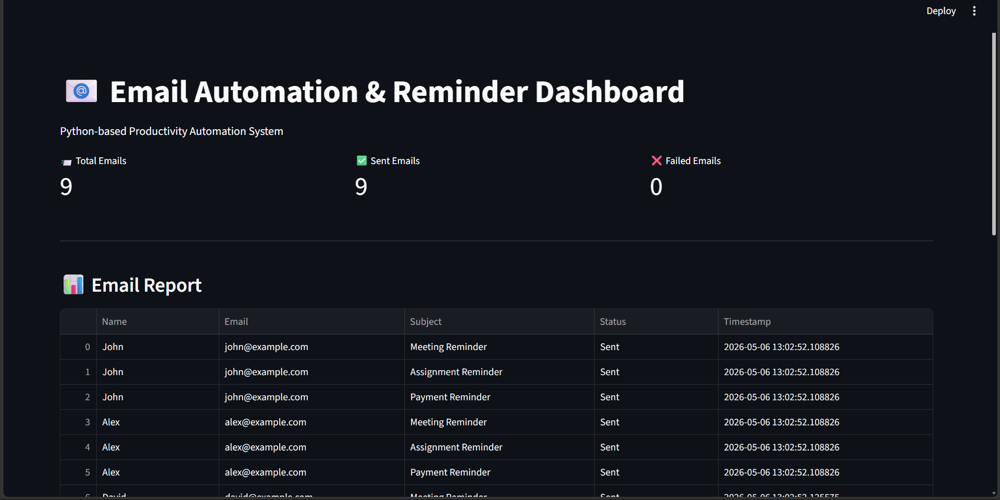
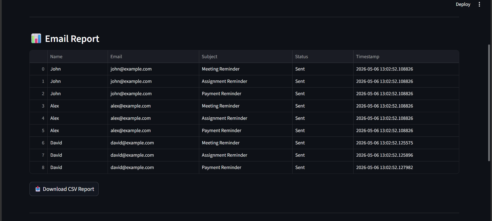
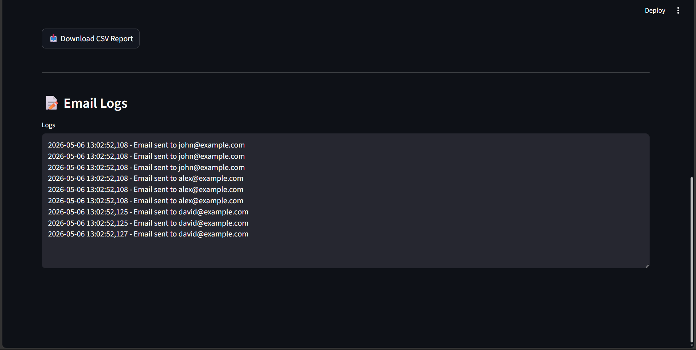

# 📧 Email Automation & Reminder System

## 📌 Project Overview

The Email Automation & Reminder System is a Python-based productivity automation project developed to automate repetitive email communication workflows.

This system reads contact information and reminder details from CSV files, generates personalized email messages using templates, tracks email delivery status, creates automation logs, and generates CSV reports.

The project simulates how companies automate reminders, notifications, and follow-up communication using Python automation tools.

---

# 🚀 Features

- Contact CSV Reading
- Reminder CSV Processing
- Personalized Email Generation
- Email Template System
- Dry-Run Email Simulation
- Logging System
- CSV Report Generation
- Streamlit Dashboard
- Metrics & Analytics
- Email Logs Viewer
- Downloadable Reports

---

# 🧠 Technologies Used

| Technology | Purpose |
|---|---|
| Python | Core Programming |
| Pandas | CSV Data Handling |
| schedule | Reminder Scheduling |
| logging | Activity Tracking |
| python-dotenv | Environment Variables |
| Streamlit | Dashboard UI |
| datetime | Timestamp Handling |
| email.message | Email Formatting |

---

# 🏗️ Project Architecture

```text
Contact CSV
      ↓
Reminder CSV
      ↓
Email Template
      ↓
Personalized Email Generation
      ↓
Reminder Scheduling
      ↓
Email Sending / Simulation
      ↓
Status Tracking
      ↓
CSV Report Generation
      ↓
Dashboard Visualization
```

---

# 📂 Folder Structure

```text
Email-Automation-Reminder-System/
│
├── data/
│      contacts.csv
│      reminders.csv
│
├── templates/
│      email_template.txt
│
├── outputs/
│      email_report.csv
│
├── logs/
│      email_logs.log
│
├── images/
│      dashboard.png
│      logs.png
│
├── README.md
├── requirements.txt
├── .gitignore
├── .env.example
├── main.py
└── app.py
```

---

# ⚙️ Installation Guide

## Clone Repository

```bash
git clone https://github.com/skkiranmayee-789/Email-Automation-Reminder-System
```

---

## Create Virtual Environment

### Windows

```bash
python -m venv venv
venv\Scripts\activate
```

### Mac/Linux

```bash
python3 -m venv venv
source venv/bin/activate
```

---

## Install Required Libraries

```bash
pip install -r requirements.txt
```

---

# 📦 requirements.txt

```text
pandas
schedule
python-dotenv
streamlit
```

---

# 🔐 Environment Variables

Create `.env` file:

```text
EMAIL_ADDRESS=your_email@gmail.com
EMAIL_PASSWORD=your_app_password
```

⚠️ Never upload real passwords or `.env` files to GitHub.

---

# ▶️ Run The Project

## Run Email Automation

```bash
python main.py
```

---

## Run Streamlit Dashboard

```bash
streamlit run app.py
```

---

# 📄 Sample Contacts CSV

```csv
Name,Email
John,john@example.com
Alex,alex@example.com
David,david@example.com
```

---

# 📄 Sample Reminder CSV

```csv
Subject,Message
Meeting Reminder,Your meeting is scheduled tomorrow at 10 AM.
Assignment Reminder,Please submit your assignment before Friday.
Payment Reminder,Your payment due date is approaching.
```

---

# 📄 Sample Email Template

```text
Hello {name},

{message}

Thank you,
Automation Team
```

---

# 📊 Sample Output

| Name | Subject | Status |
|---|---|---|
| John | Meeting Reminder | Sent |
| Alex | Assignment Reminder | Sent |
| David | Payment Reminder | Sent |

---

# 📸 Screenshots

## Dashboard Overview



---

## Email Report Table



---

## Email Logs



# 📈 Dashboard Features

- Total Email Metrics
- Sent/Failed Email Count
- Automation Report Table
- Download CSV Report
- Email Logs Viewer

---

# 🧪 Dry Run Mode

This project uses dry-run simulation for safe testing.

Instead of sending real emails:
- messages are printed in terminal,
- logs are generated,
- reports are created.

This avoids:
- spam issues,
- credential risks,
- accidental email sending.

---

# 🔒 Security Best Practices

- Never upload `.env`
- Never upload real passwords
- Use `.env.example`
- Use `.gitignore`
- Use dummy email addresses for testing

---

# 💡 Industry Relevance

This project demonstrates how businesses automate:
- reminder systems,
- follow-up communication,
- HR notifications,
- productivity workflows,
- admin operations,
- customer engagement processes.

---

# 🎯 Learning Outcomes

Through this project, I learned:

- Python automation
- CSV processing
- Email workflow systems
- Logging systems
- Productivity automation
- Streamlit dashboard development
- Environment variable handling
- GitHub project management

---

# 🔮 Future Improvements

- Real SMTP email sending
- Scheduled task automation
- Email analytics charts
- Cloud deployment
- Database integration
- Multi-user authentication
- Advanced dashboard UI

---

# 👨‍💻 Author

Developed by:
Sivvam Karthikeya Kiranmayee

---

# ⭐ Conclusion

The Email Automation & Reminder System is a beginner-friendly yet industry-relevant Python automation project that demonstrates personalized communication workflows, reminder automation, reporting systems, and productivity dashboard development using Streamlit.
